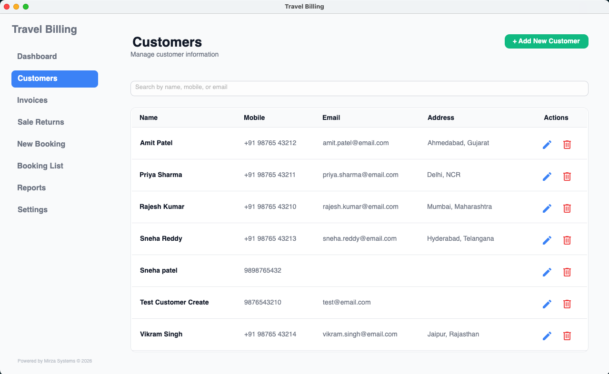

# Travel Billing Desktop Application  
### Product Case Study & Architecture Overview

> ⚠️ This repository does not contain source code.  
> It exists as a portfolio case study and architectural overview of a proprietary commercial desktop application.

---

## 📌 Project Context

TravelBilling is a lightweight, offline-first desktop billing system designed for small-to-medium travel agencies.

The goal was to engineer a structured and scalable billing solution capable of:

- Invoice generation
- GST computation
- Sale return handling
- Booking management
- Customer management
- Professional PDF exports
- Secure access control

The system was built with clean architecture principles and long-term maintainability in mind.

---

## 🛠 Technology Stack

- .NET SDK  
- Avalonia UI (Cross-platform Desktop Framework)  
- SQLite (Local Database)  
- MVVM Architecture  
- Clean Architecture Principles  
- PDF Generation Engine  
- Figma (UI/UX Prototyping)  

---

## 🏗 Architectural Approach

The system follows Clean Architecture combined with MVVM for separation of concerns and scalability.

### Layered Structure

**Presentation Layer**
- Views  
- ViewModels  
- Navigation system  

**Core Layer**
- Business Models  
- Domain Logic  
- Interfaces  

**Infrastructure Layer**
- SQLite Data Access  
- Repository Implementations  
- PDF Services  

### Engineering Principles Applied

- Separation of Concerns  
- Dependency Inversion  
- Interface-driven Services  
- Modular Design  
- Stack-agnostic architecture thinking  

---

## ✨ Key Features

### Invoice Engine
- Dynamic invoice creation  
- Automated GST calculations  
- Sequential invoice numbering  
- Detailed invoice view  

### Booking Management
- Booking list management  
- New booking creation  
- Booking detail view  

### Customer Management
- Add / Edit / View customers  
- Customer detail screens  
- Persistent local storage  

### Reports Module
- Structured reporting interface  
- Financial data overview  

### Sale Return Handling
- Transaction reversal support  
- Ledger consistency  

### Security
- PIN lock screen  
- License generator integration  

### PDF Export System
- Structured invoice layout  
- Business-ready export format  
- Print-friendly design  

### Offline-First Architecture
- Fully local SQLite storage  
- No cloud dependency  

---

# 📷 Application Preview

All screenshots use demo/sample data.  
No real client or financial data is included.

---

---

## 🌞 Light Mode

---

## 🌙 Dark Mode

---

## 🤖 AI-Augmented Development Workflow

Modern AI-assisted tools were leveraged during development:

- Figma AI / Figma Make – UI prototyping  
- Claude Code Pro – Architectural scaffolding & structural planning  
- ChatGPT – Technical exploration & documentation refinement  

AI tools were used to accelerate iteration and experimentation.  
All architectural decisions, business logic implementation, and validation were manually engineered and reviewed.

This reflects a modern AI-augmented development workflow where tooling enhances — but does not replace — engineering judgment.

---

## 🔐 Intellectual Property Notice

This software is proprietary and commercially licensed.

- Source code is private  
- Redistribution or replication is not permitted  
- This repository exists solely for demonstration of engineering capability  

For collaboration or licensing discussions, please connect directly.

---

## 🎯 Engineering Objective

This project demonstrates:

- Cross-stack adaptability outside a primary iOS ecosystem  
- Desktop application architecture design  
- Database modeling & CRUD implementation  
- Invoice engine development  
- End-to-end product thinking (UI → Database → PDF pipeline)  
- Production-grade feature structuring  

Engineering fundamentals remain stack-agnostic.

---

## 👤 About the Developer

Software engineer with 7+ years of experience, primarily in iOS development, focused on:

- Architecture  
- Performance optimization  
- Clean code practices  
- Scalable system design  

This project reflects cross-platform capability and modern product-driven engineering.

---

All Rights Reserved.
